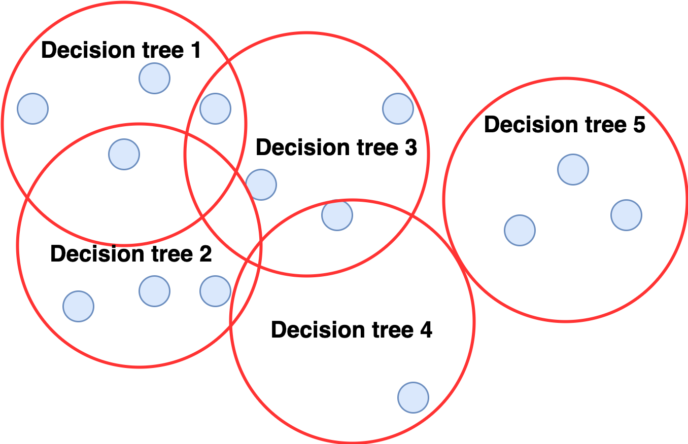

# Spatial Random Forest implementation in Python

This repository provides Python implementations of a spatial Random Forest. Different approaches have been proposed in the literature, including:
* *Geographical Random Forests*: Training one random forest per sample, using only the sample's neighbors as training data (similar to GWR)
* Simply using coordinates as covariates
* *Random Forest Spatial Interpolation*: Including the actual observations at the nearest locations of the prediction location as covariates

Here, we implement a variant of Geographical Random Forests: Instead of training one Random Forest per sample, we train a fixed number of random forests on spatially distinct set of points. The prediction is then a weighted average of the tree-wise predictions, weighted by the distance of the test sample from the centers of each tree (see figure).



### Installation:

To install sprf in a new Python environment, run
```
cd spatial_rf_python
python -m venv env
source env/bin/activate
pip install .
```

### Usage

The usage is analogous to other scikit-learn models, except that the coordinates must also be given as input:
```
from sprf import SpatialRandomForest
spatial_rf = SpatialRandomForest()
spatial_rf.fit(train_x, train_y, train_coords)
test_pred = spatial_rf.predict(test_x, test_coords)
```

### Benchmarking

In the [benchmarking notebook](benchmarks.ipynb), we compare the spatial RF on some benchmark datasets (see [data](data) folder), namely:
* A [plants](https://github.com/BlasBenito/spatialRF/blob/main/data/plant_richness_df.rda) dataset
* A [deforestation](https://github.com/FSantosCodes/GWRFC/tree/master/data) dataset
* A [mortality rate](https://www.dropbox.com/s/lrz6og0ld2m64df/Data_GWR.7z?dl=0) dataset from [here](https://zia207.github.io/geospatial-r-github.io/geographically-wighted-random-forest.html)

All of these datasets were used by other spatial random forest implementations. Please cite their work if reusing their data.